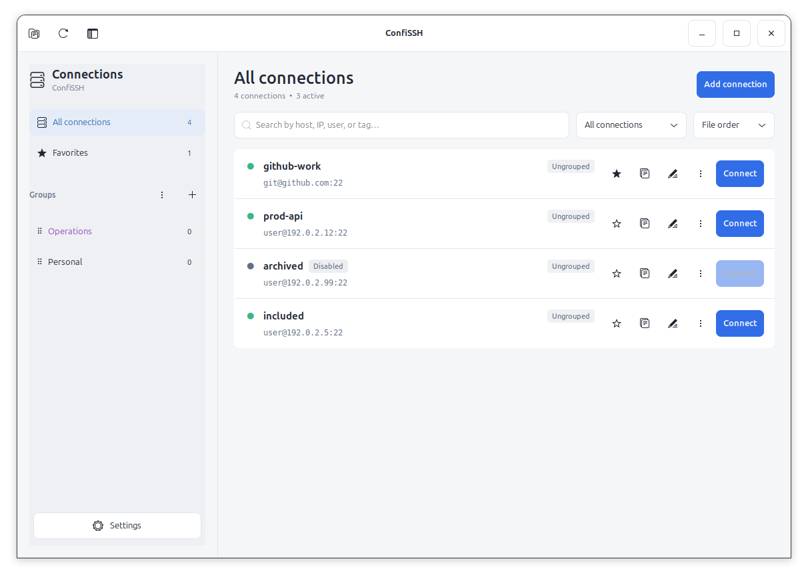
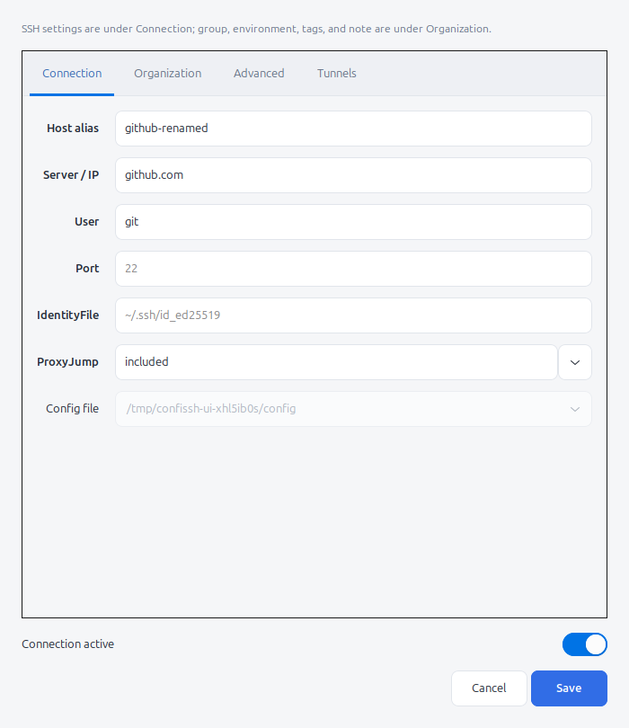
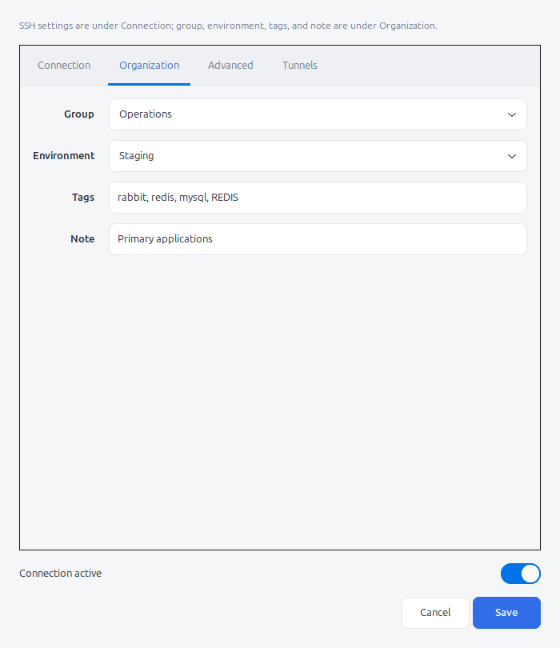
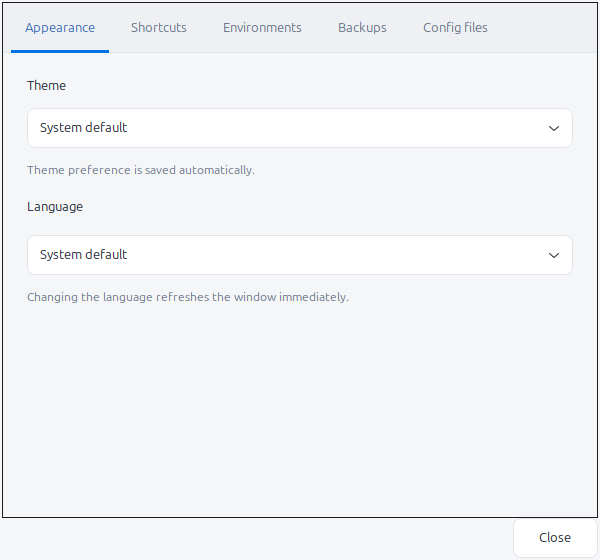
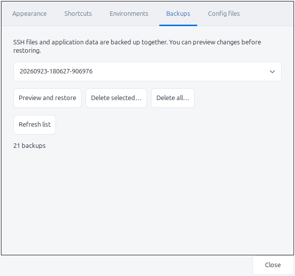

# ConfiSSH

[Türkçe README](README.tr.md)

ConfiSSH is a GTK-based OpenSSH connection manager for Linux. It keeps the
standard `ssh host-alias` workflow intact: SSH directives remain in OpenSSH
config files, while application-only metadata is stored separately.

## Features

- View, search, add, edit, duplicate, disable, and remove SSH connections.
- Work with `Include` files without flattening or rewriting unrelated content.
- Organize connections into UUID-backed groups with custom ordering and colors.
- Drag connections onto groups and reorder groups with drag and drop.
- Add environments, colors, tags, notes, favorites, and recent-use metadata.
- Configure ProxyJump, tunnels, identity files, keep-alive options, and arbitrary
  OpenSSH directives.
- Preview changes before saving and restore paired SSH/metadata backups.
- Use light, dark, or system themes.
- Use the interface in English or Turkish, or follow the system language.

## Screenshots

<picture>
  <source media="(prefers-color-scheme: dark)" srcset="docs/screenshots/confissh-dark.png">
  <source media="(prefers-color-scheme: light)" srcset="docs/screenshots/confissh-light.png">
  
</picture>

| Connection settings | Organization metadata |
|:--:|:--:|
|  |  |

| Appearance | Backups |
|:--:|:--:|
|  |  |

The screenshots are generated by the isolated GTK workflow test and contain
only disposable test data.

## Data model

- `~/.ssh/config` and its `Include` files contain `HostName`, `User`, `Port`,
  `IdentityFile`, `ProxyJump`, tunnels, and all other standard SSH directives.
- `~/.config/confissh/connections.json` contains UUID-based connection metadata,
  groups, environments, tags, notes, favorites, and recent-use timestamps.
- `~/.config/confissh/preferences.json` contains theme, language, sidebar, and
  ordering preferences.
- `~/.config/confissh/backups/` contains timestamped snapshots of SSH files and
  application metadata. Backups may contain sensitive connection details, are
  written with `0600` permissions, and are not deleted automatically.

`XDG_CONFIG_HOME` is supported. On first launch, ConfiSSH adds an identifier to
hosts that do not have one and creates a backup before writing. The only
application-specific field written to an SSH file is a comment:

```ssh-config
# confissh-key: 24e6b5d6-99c2-43dd-abcc-ad7eeef59a32
Host prod-api
  HostName 192.0.2.12
  User deploy
  IdentityFile ~/.ssh/id_ed25519
```

Example application metadata:

```json
{
  "version": 1,
  "groups": {
    "a0d217fa-861c-42ad-b2b9-d13ba50153c2": {
      "name": "Operations",
      "order": 0
    }
  },
  "environments": {
    "b0d217fa-861c-42ad-b2b9-d13ba50153c2": {
      "name": "Production",
      "color": "#e35d6a"
    }
  },
  "connections": {
    "24e6b5d6-99c2-43dd-abcc-ad7eeef59a32": {
      "group_id": "a0d217fa-861c-42ad-b2b9-d13ba50153c2",
      "environment_id": "b0d217fa-861c-42ad-b2b9-d13ba50153c2",
      "tags": ["redis", "mysql"],
      "note": "Primary server",
      "favorite": true
    }
  }
}
```

Group and environment names are labels, not identifiers. Renaming them does not
change connection relationships or SSH files. Connection metadata follows its
UUID if the host alias or source file changes. Duplicating a connection creates
a new UUID.

## Usage notes

- SSH fields and the destination config file are under the Connection tab.
  Group, environment, tags, and note are under Organization.
- Create empty groups with the plus button beside Groups. Move a connection by
  dragging it onto a group or using its context menu.
- Right-click a group to rename it, change its color, move it, or delete it.
  Deleting a group can move its connections to another group or leave them
  ungrouped; it never deletes the connections.
- Choose alphabetical or custom group ordering. Alphabetical view does not erase
  the stored custom order.
- Define environments under Settings → Environments. Production, Sandbox, and
  Development are created as examples on first launch but are not assigned
  automatically. Reset to defaults restores missing defaults and their colors
  while preserving custom environments and assignments.
- Tags are comma-separated and searchable. Environment colors appear on the
  left edge of connection rows.
- ProxyJump can be selected from active connections, including entries from
  `Include` files, or entered manually as an address or jump chain.
- Backups under Settings → Backups restore SSH files and metadata together.
  A restore first shows a diff and also backs up the current state.
- Search starts with the first character. Keyboard shortcuts are listed in
  Settings → Shortcuts.

Writes use file locks, atomic replacement, and a transaction journal. If one
part of a paired SSH/JSON write fails, the previous state is restored. Multiple
files cannot form one operating-system-level atomic operation, so interrupted
transactions are checked and recovered on the next launch.

## Localization

English is the source and fallback language. Select `System default`, `English`,
or `Türkçe` under Settings → Appearance → Language. The open window refreshes
immediately when the language changes.

Turkish translations live in
`confissh/resources/locales/tr.json`. New user-facing strings should be written
in English and passed through `_(...)`; plural messages use `ngettext(...)`.
Unknown or unavailable translations fall back to the English source text.

For deterministic automation, set `CONFISSH_LANGUAGE=en` or
`CONFISSH_LANGUAGE=tr`.

## End-user installation

Download a ready-made package from the repository's GitHub Releases page. You
do not need the source tree or `make`.

### Ubuntu and Debian (.deb)

The following commands resolve the latest GitHub release, generate its AMD64
DEB asset name, and install it. The version number does not need to be updated:

```bash
release_url=$(curl -fsSL -o /dev/null -w '%{url_effective}' \
  https://github.com/cihankaya77/confiSSH/releases/latest)
release_tag=${release_url##*/}
version=${release_tag#v}
package="/tmp/confissh_${version}_amd64.deb"
curl -fL \
  "https://github.com/cihankaya77/confiSSH/releases/download/${release_tag}/confissh_${version}_amd64.deb" \
  -o "$package"
sudo apt install "$package"
```

`apt` installs the required Python, GTK 3, and OpenSSH packages. Launch ConfiSSH
from the application menu or run:

```bash
confissh
```

### Fedora (.rpm)

The following commands resolve the latest GitHub release, generate its RPM
asset name, and install it:

```bash
release_url=$(curl -fsSL -o /dev/null -w '%{url_effective}' \
  https://github.com/cihankaya77/confiSSH/releases/latest)
release_tag=${release_url##*/}
version=${release_tag#v}
package="/tmp/confissh-${version}-2.noarch.rpm"
curl -fL \
  "https://github.com/cihankaya77/confiSSH/releases/download/${release_tag}/confissh-${version}-2.noarch.rpm" \
  -o "$package"
sudo dnf install "$package"
```

The RPM uses the system Python (3.10+) and installs its application sources in
`/usr/share/confissh`, independently of the build environment’s Python version.
`dnf` installs the required Python, GTK 3, and OpenSSH packages. Launch ConfiSSH
from the application menu or with `confissh`.

### AppImage

The AppImage does not install system packages. It is intentionally thin and
uses Python, GTK 3, and OpenSSH from the host system. First install its runtime
dependencies.

Ubuntu/Debian:

```bash
sudo apt install python3 python3-gi gir1.2-gtk-3.0 openssh-client
```

Fedora:

```bash
sudo dnf install python3 python3-gobject gtk3 openssh-clients
```

Then download and run the x86_64 AppImage from the latest GitHub release:

```bash
release_url=$(curl -fsSL -o /dev/null -w '%{url_effective}' \
  https://github.com/cihankaya77/confiSSH/releases/latest)
release_tag=${release_url##*/}
version=${release_tag#v}
appimage="ConfiSSH-${version}-x86_64.AppImage"
curl -fL \
  "https://github.com/cihankaya77/confiSSH/releases/download/${release_tag}/${appimage}" \
  -o "$appimage"
chmod +x "$appimage"
"./$appimage"
```

Delete the AppImage file to remove it.

### Updating and uninstalling

Install a newer DEB or RPM with the same installation command. Replace the old
file for AppImage updates.

```bash
# Ubuntu/Debian
sudo apt remove confissh

# Fedora
sudo dnf remove confissh
```

Uninstalling does not remove `~/.ssh/config` or data and backups under
`~/.config/confissh`. Delete those files separately only if you no longer need
them.

## Development and verification

On Ubuntu:

```bash
sudo apt install python3 python3-gi python3-cairo python3-gi-cairo gir1.2-gtk-3.0 \
  openssh-client desktop-file-utils xauth xvfb libx11-6 libxtst6
make run
make test
make lint
make check-ui
make check-drag
```

GTK checks use temporary config and data directories. The real drag-and-drop
check requires X11/XWayland, libX11, and libXtst. To run with the example SSH
file:

```bash
CONFISSH_CONFIG="$PWD/examples/config" make run
```

ConfiSSH adds connection identifiers to that file on first launch.

## Building packages from source

DEB:

```bash
make deb
sudo apt install ./dist/confissh_0.1.1_amd64.deb
```

RPM on Fedora (the same package is tested on Fedora 42, 43, and 44):

```bash
sudo dnf install rpm-build python3
make rpm
sudo dnf install ./dist/confissh-0.1.1-2.noarch.rpm
```

Build the same Fedora RPM from Ubuntu with Docker:

```bash
make rpm-docker
make check-rpm
```

AppImage:

```bash
sudo apt install squashfs-tools curl
make appimage
./dist/ConfiSSH-0.1.1-x86_64.AppImage
```

The thin AppImage is not sandboxed, so it can access `~/.ssh` and the system
terminal. It expects Python 3.10+, PyGObject, GTK 3, and OpenSSH on the host. The
first build downloads the official AppImage type-2 runtime into
`build/appimage` and verifies its pinned SHA-256 digest. Set `APPIMAGE_RUNTIME`
to use a pre-downloaded runtime. x86_64 and aarch64 are supported.

Run `make packages` to build all three formats. On systems without
`rpmbuild` and an RPM-managed Python installation, the RPM is built in the Fedora Docker container
automatically. Outputs are written to `dist/`.

## CI/CD and releases

Every push and pull request runs unit tests, static checks, GTK workflow tests,
the real drag-and-drop check, and package builds in GitHub Actions.

To prepare a release, update `confissh/__init__.py` and `CHANGELOG.md`, merge the
changes into the main branch, and push a matching tag:

```bash
git tag v0.1.1
git push origin v0.1.1
```

The tag workflow publishes DEB, Fedora RPM, AppImage, and SHA-256 checksums in
a GitHub Release. See `CONTRIBUTING.md` for contribution guidelines and
`SECURITY.md` for private vulnerability reporting.
